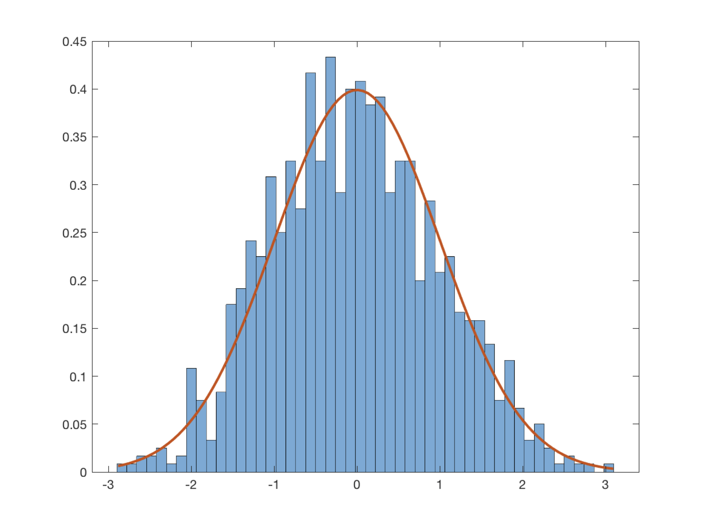

Distributions 
==============

A series of classes for modeling distributions and stochastic processes.

If you use these classes, please cite the following paper,
- J. Early and A. Sykulski. Smoothing and interpolating noisy GPS data with smoothing splines. IEEE Transactions on Signal Processing. In prep.

### Table of contents
1. [Quick start](#quick-start)
2. [Distribution class](#distribution-class)


------------------------

Quick start
------------

The `Distribution` class is an abstract class, so in practice one only uses its subclasses such as `NormalDistribution` directly. For example, to create a Gaussian distribution,
```matlab
sigma = 1;
distribution = NormalDistribution(sigma);
```
and now you can create some random values,
```matlab
n = 1000;
z = distribution.rand([n 1]);
```
and plot those values,
```matlab
figure
histogram(z,'Normalization','pdf')
```
which can be compared against the expected pdf,
```matlab
zdist = linspace(min(z),max(z),100)';
hold on
plot(zdist,distribution.pdf(zdist))
```
<p align="center"></p>

All distribution subclasses include the `cdf` as a function, as well as the total variance of the process.

### Correlated values

It is also sometimes useful to correlate the random values in order to create a stochastic process. Let's define an autocorrelation sequence,
```matlab
tau = 10;
distribution.rho = @(z) exp(-(z/tau).^2);
```
and now generate a signal,
```matlab
t = (0:500).';
z = distribution.noise(t);
```
<p align="center"></p>

The signal now looks smooth on time scales less than O(tau).


Overview
------------

The `Distribution` class is an abstract class, but most subclasses only need to define a `pdf` and `cdf` in order to gain most of the useful functionality, such as random number generation, stochastic process generation, as well as error metrics like the Anderson-Darling and Kolmogorov-Smirnov errors.

There are currently five built-in distribution subclasses,

- [NormalDistribution](#normal-distribution)
- [StudentTDistribution](#students-t-distribution)
- RayleighDistribution
- [AddedDistribution](#added-distribution)
- [TwoDimDistanceDistribution](#two-dimensional-distance-distribution)


Distribution class
------------

The distribution class represents a univariate [probability distribution](https://en.wikipedia.org/wiki/Probability_distribution). As such the class requires the following properties,

- `pdf`, the [probability density function](https://en.wikipedia.org/wiki/Probability_density_function) defined as a function, e.g., `@(z) exp(-(z.*z)/(2*sigma*sigma))/(sigma*sqrt(2*pi))`.
- `cdf`, the [cumulative distribution function](https://en.wikipedia.org/wiki/Cumulative_distribution_function) defined as a function, e.g., `@(z) 0.5*(1 + erf(z/(sigma*sqrt(2))))`.

Optionally, one can also define

- `rho`, the [autocorrelation](https://en.wikipedia.org/wiki/Autocorrelation) function of the process.

When the `cdf` is defined, the following functions can be used,

- `rand()`, generates random numbers with the cdf.
- `locationOfCDFPercentile()` returns the location of a given cdf percentile.
- `varianceInRange()` returns the variance between two cdf percentiles.
- `varianceInPercentileRange()` returns the total variance in a given percentile range.
- `kolmogorovSmirnovError()`, returns the [Kolmogorov-Smirnov](https://en.wikipedia.org/wiki/Kolmogorov–Smirnov_test) test statistic for a given set of data.
- `andersonDarlingError()`, returns the [Anderson-Darling](https://en.wikipedia.org/wiki/Anderson–Darling_test) test statistic  for a given set of data.

Once `rho` is also defined,

- `noise()` returns a signal with increments following `rand` and autocorrelation sequence following `rho`.

Normal distribution
------------

The `NormalDistribution` does the obvious thing and adds a single additional property, `sigma` and implements a [normal distribution](https://en.wikipedia.org/wiki/Normal_distribution).


Student's t-distribution
------------

The `StudentTDistribution` has additional two properties, `sigma` and `nu`, and implements a [Student's t-distribution](https://en.wikipedia.org/wiki/Student%27s_t-distribution).

Added distribution
------------

The `AddedDistribution` is a univariate [mixture distribution](https://en.wikipedia.org/wiki/Mixture_distribution), essentially the sum of two (or more) distributions.

The class is initialized with `AddedDistribution(scalings,distribution1,distribution2,varargin)` where scalings is a vector that must sum to 1, followed by two (or more) distributions

Two dimensional distance distribution
------------

The `TwoDimDistanceDistribution` takes a single one-dimensional distribution and returns the radial distribution of two independent distribution on x-y. Thus, for a normal distribution this gives you an emirically computed [Rayleigh distribution](https://en.wikipedia.org/wiki/Rayleigh_distribution).
