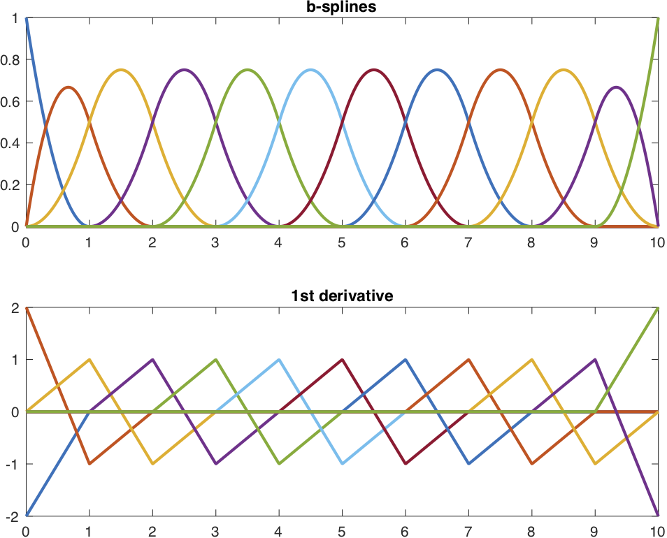
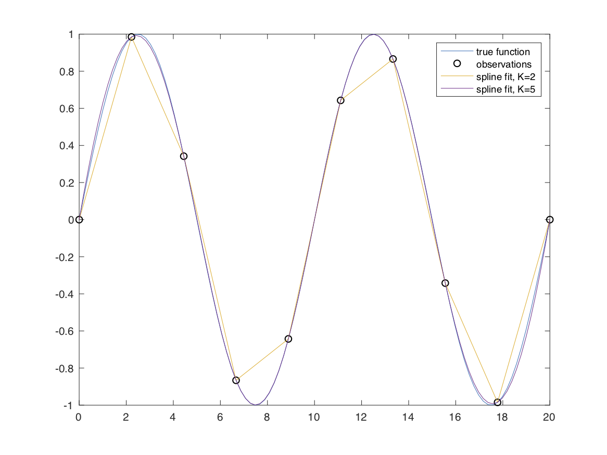
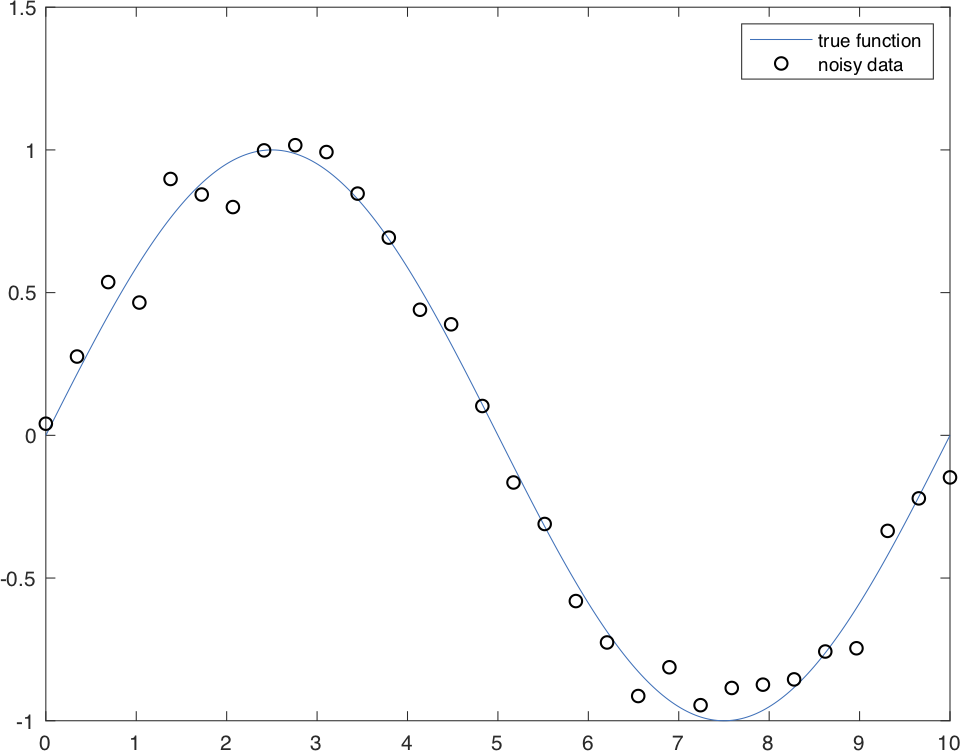

Interpolating splines, tension splines and b-splines 
==============

A series of classes for interpolating and smoothing data using b-splines.

The `InterpolatingSpline` class is useful for interpolating between points when the data is not noisy, while the `TensionSpline` class is useful for smoothing noisy data. Both classes are subclasses of `BSpline`, which can be used to generate b-splines from any set of knot points. 

If you use these classes, please cite the following paper,
- J. Early and A. Sykulski. Smoothing and interpolating noisy GPS data with tension splines. IEEE Transactions on Signal Processing. In prep.

### Table of contents
1. [Quick start](#quick-start)
2. [Basis spline](#basis-spline)
2. [Interpolating spline](#interpolating-spline)
2. [Tension spline](#tension-spline)
2. [GPS tension spline](#gps-tension-spline)

------------------------

Quick start
------------

### Interpolating spline

The `InterpolatingSpline` class is useful for interpolating smooth functions. Initialize with data (x,y),
```matlab
x = linspace(0,20,10)';
y = sin(2*pi*x/10);
spline = InterpolatingSpline(t,x)
```
and now you can evaluate the interpolated value,
```matlab
x_dense = linspace(0,20,100)';
y_dense = spline(x_dense);
```
By default the class uses cubic spline, but you can initialize with whatever order of spline you want, e.g.,
```matlab
spline = InterpolatingSpline(t,x,'K',5)
```

### Tension spline

If your data is noisy, you'll want to use the `TensionSpline` class instead. In this example we sample a smooth function (sine) and contaminate it Gaussian noise,
```matlab
N = 30;
L = 10;
sigma = 0.1;

x = linspace(0,L,N)';
y = sin(2*pi*x/L) + sigma*randn(N,1);
```
and then initialize the `TensionSpline` class with the data and the standard deviation of the noise,
```matlab
spline = TensionSpline(x,y,sigma)
```
That's it! The `spline` object can be evaluated at any point in the domain, just as with the interpolating spline class.

### GPS Tension spline

The `GPSTensionSpline` class offers some GPS specific additions to the `TensionSpline` class including t-distributed errors and outlier detection.

Basis spline
------------

The `BSpline` class is a primitive class that creates b-splines given some set of knot points, and then evaluates the splines given some set of coefficients for the splines.

The class would be initialized as follows,
```matlab
K = 3; % order of spline
D = K-1; % number of derivates to return
t = (0:10)'; % observation points

% increase the multiplicity of the end knots for higher order splines
t_knot = [repmat(t(1),K-1,1); t; repmat(t(end),K-1,1)];

nSplines = length(t)+K-2;

% coefficients for the bsplines---set all of them to zero for now.
m = zeros(nSplines,1);

% initialize the BSpline class
B = BSpline(K,t_knot,m);
```

If you set the coefficient of one of the splines to 1, e.g.,
```matlab
m = zeros(nSplines,1);
m(3) = 1;
B.m = m;
```
Then you can plot that particular spline,
```matlab
tq = linspace(min(t),max(t),1000)';
figure, plot(tq,B(tq),'LineWidth',2)
```
Here's an image of all the splines and their first derivatives plotted,
<p align="center"></p>

Note the usage here that calling `B(t)` evaluates the splines at points `t`.

This class serves as a useful building block for other classes.

Interpolating spline
------------

An interpolating spline uses local b-splines to interpolate across points. The (K-1)th derivative of a K order spline is piecewise continuous.

### Example

Let's start by defining a  function,
```matlab
L = 10;
f = @(x) sin(2*pi*x/L);
```
create a grid of observation points,
```matlab
N = 10;
x = linspace(0,2*L,N)';
```
and then sampling the function at the observation points
```matlab
y = f(x);
```
Let's create a dense grid in x just to better visualize the true function, and the sample points.
```matlab
x_dense = linspace(0,2*L,10*N)';

figure
plot(x_dense,f(x_dense)), hold on
scatter(x,y,'k')
legend('true function', 'observations')
```
Finally, let's use an interpolating spline,
```matlab
spline = InterpolatingSpline(x,y);

figure
plot(x_dense,f(x_dense)), hold on
scatter(x,y,'k')
plot(x_dense,spline(x_dense))
legend('true function', 'observations', 'spline fit')
```
This spline fit is identical to Matlab's built in griddedInterpolant with the 'spline' option,
```matlab
ginterp = griddedInterpolant(x,y,'spline');

residual = ginterp(x_dense)-spline(x_dense);
relative_error = max(abs(residual))/max(abs(y)) % returns O(1e-16)
```
However, unlike Matlab's implementation, this class lets you specify the order of the spline to something other than cubic (K=4). For example, we can do a K=2 fit (which is just linear interpolation), but also a (K=5) fit.
```matlab
spline_2 = InterpolatingSpline(x,y,'K',2);
spline_5 = InterpolatingSpline(x,y,'K',5);

figure
plot(x_dense,f(x_dense)), hold on
scatter(x,y,'k')
plot(x_dense,spline_2(x_dense))
plot(x_dense,spline_5(x_dense))
legend('true function', 'observations', 'spline fit, K=2', 'spline fit, K=5')
```

<p align="center"></p>

### Options

The `InterpolatingSpline` class takes name/value pairs at initialization to set the spline order (or degree).

- `'K'` spline order, default is 4.
- `'S'` spline degree (order-1), default is 3.

Tension spline
------------

A tension spline can be used to smooth noisy data and attempt to recover the "true" underlying function.

### Example

Let's start by defining a new function,
```matlab
L = 10;
f = @(x) sin(2*pi*x/L);
```
create a grid of observation points,
```matlab
N = 30;
x = linspace(0,L,N)';
```
and then sampling the function at the observation points while adding Gaussian noise,
```matlab
sigma = 0.1;
y = f(x) + sigma*randn(N,1);
```
Let's create a dense grid in x just to better visualize the true function, and then plot the function and noisy observations,
```matlab
x_dense = linspace(0,L,10*N)';

figure
plot(x_dense,f(x_dense)), hold on
scatter(x,y,'k')
legend('true function', 'noisy data')
```

<p align="center"></p>

Finally, let's use a tension spline to try to smooth the data and plot the results,
```matlab
spline = TensionSpline(x,y,sigma);

figure
plot(x_dense,f(x_dense)), hold on
scatter(x,y,'k')
plot(x_dense,spline(x_dense),'LineWidth',2)
legend('true function', 'noisy data', 'tension spline fit')
```

<p align="center"></p>

### Options

The `TensionSpline` class takes name/value pairs at initialization to set the spline order (or degree).

- `'K'` spline order, default is 4.
- `'S'` spline degree (order-1), default is 3.
- `'T'` tension degree , default is to use the same degree as the spline.
- `'lambda'` tension parameter, either pass a numeric value, or the `Lambda` enumeration. Default is `Lambda.optimalIterated`.
- `'mu'` mean tension.
- `'weightFunction'` the reweighting function if the errors are not gaussian.
- `'knot_dof'` number of degrees of freedom to be used in placing knot points. Either specify an integer, or `'auto'` to have the algorithm attempt to choose an appropriate number. Default is 1.

The `Lambda` enumeration has the following values,

- `optimalIterated`  which minimize the expected mean-square error, but may take a while for lots of data.
- `optimalExpected`  which takes a guess at minimizing the mean-square error based on the effective sample-size.
- `fullTensionExpected`  which takes a guess at the full tension solution assuming infinite effective sample size.

GPS Tension spline
------------

The `GPSTensionSpline` class is useful for smoothing noisy gps data and removing outliers. The class is initialized with,
```matlab
spline = GPSTensionSpline(t,x,y);
```
where `t` is time, and `x,y` are *projected* positions in meters. By default, the class will,

1. identify outliers and,
2. smooth the data to the appropriate value.

The results can then be evaluated at any time,
```matlab
[x_smooth,y_smooth] = spline(t);
```

### Properties

The  `GPSTensionSpline` class encapsulates two properties, `spline_x` and `spline_y` which are just independent `TensionSpline` objects for the x and y data.

The `distanceError` property is root mean square of the spline errors under full tension. This property is only populated when looking for outliers.

The `indicesOfOutliers` contains the indices of the outliers that were detected. The outliers are not used in the final fits.

### Options

The `GPSTensionSpline` class takes name/value pairs at initialization to set the spline order (or degree).

- `'K'` spline order, default is 4.
- `'S'` spline degree (order-1), default is 3.
- `'T'` tension degree , default is to use the same degree as the spline.
- `'sigma'` sigma parameter in the student t distribution. Default is 8.5.
- `'nu'` nu parameter in the student t distribution. Default is 4.5.
- `'shouldIdentifyOutliers'` either 1 or 0. Default is 1.


